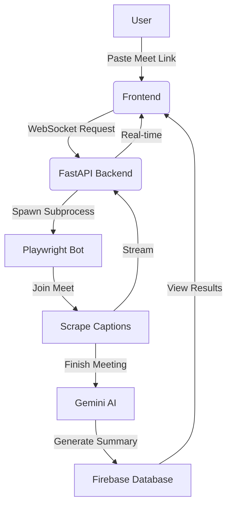

# 🎙️ Meet Scribe

**AI that listens, so you don't have to.**

Meet Scribe is a state-of-the-art AI meeting assistant that automatically joins your Google Meet calls, captures every word, and delivers high-impact, structured summaries—all in real-time.

---

## Live Demo

Experience Meet Scribe in action:  
**[Live Website](https://meet-scribe-c0367.web.app)**

---

## Key Features

- **Autonomous Bot**: Set it and forget it. The bot joins your meeting via a simple link.
- **Transcription**: Watch as words turn into text with low-latency WebSocket streaming.
- **AI Synthesis**: Powered by **Google Gemini Pro**, generating intelligent summaries, action items, and key takeaways.
- **Interactive Dashboard**: Manage your meeting history, view transcripts, and export insights effortlessly.
- **Private & Secure**: Enterprise-grade architecture ensuring your meeting data stays yours.

---

## Technical Masterpiece

### The Tech Stack
- **Frontend**: `React` + `Vite` + `TypeScript` + `Tailwind CSS`
- **Backend**: `Python` + `FastAPI` (High-performance API layer)
- **Bot Engine**: `Playwright` + `Headless Chromium`
- **AI Engine**: `Google Gemini 1.5 Pro`
- **Infrastructure**: `Firebase` (Auth, Firestore) + `WebSocket`

### How It Works


---

## Quick Installation

### Prerequisites
- Python 3.9+
- Node.js 18+
- Docker (Optional)
- Google Gemini API Key

### 1. Clone & Configure
```bash
git clone https://github.com/manissh-meet-scribe/Meet_Scribe.git
cd Meet_Scribe

# Configure Backend
cp backend/.env.example backend/.env

# Configure Frontend
cp frontend/.env.example frontend/.env.local
```

### 2. Launch with Docker (Recommended)
```bash
docker compose up --build
```

### 3. Manual Startup
**Backend:**
```bash
cd backend
python -m venv venv
source venv/bin/activate  # venv\Scripts\activate on Windows
pip install -r requirements.txt
playwright install chromium
uvicorn app.main:app --reload
```

**Frontend:**
```bash
cd frontend
npm install
npm run dev
```

---

## Design Philosophy
Meet Scribe was built with a **"Performance First"** mindset:
- **Stateless Scaling**: Designed to run efficiently in containerized environments.
- **Memory Optimization**: Headless Chromium is tuned to minimize RAM usage during long calls.
- **Glassmorphism UI**: A premium, modern interface designed for focus and clarity.

---

## Contributing
Contributions are welcome! If you have ideas for new features or find bugs, please open an issue or submit a PR.

## License
Distributed under the MIT License. See `LICENSE` for more information.

---

<p align="center">
  Built with ❤️ for better meetings.
</p>
